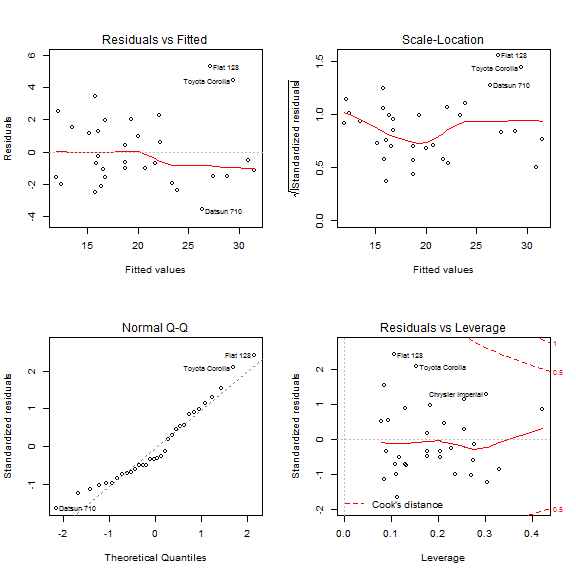

# Exploring the Relationship between Transmission Type and Fuel Economy
### *Written By: Jovan Sardinha (jovan.sardinha@gmail.com)*   
### *Date: June 22, 2014*  
<hr>
## Executive Summary
Motor Trend is interested in exploring the relationship bettween miles per gallon (MPG) and the transmission type of a car. This analysis conlcuded that on average cars with manual transmission  provide better fuel economy than their automatic transmission counterparts. 

To quantify the relationship between fuel economy and transmission type, the regression model chose states with 90% confidence, that a car with manual tranmission provides 8.625 additional miles per (US) gallon in comparison to the it's automatic transmission counterpart. Furthermore, for every 3.485 increase in the wieght (lb/1000) of a manual transmission car, there is a 1 MPG decrese in fuel efficiency in comparison to it's automatic transmission counterpart. 


## Objective and Scope
Motor Trend, an automotive magazine is interested in exploring the relationship bettween miles per gallon (MPG) and the transmission type of a car. They are particularly interested in the following two questions:     
     1. Is an automatic or manual transmission better for MPG?   
	2. Quantifying how different is the MPG between automatic and manual transmissions?   
This analysis will use the [mtcars](http://stat.ethz.ch/R-manual/R-devel/library/datasets/html/mtcars.html) dataset for the analysis.

## Results and Discission
### Exploratory analysis
The first step was to clean the data and ensure that it was ready for analysis. Figure A1 in the appendix, shows the relationship between variables and from looking at the stepwise distribution of the following variables <code>($cyl, $vs, $am, $gear, $carb)</code>, it was decided to make them factor variables in this analysis. 

### Analyzing group statistics
The first question is answered by the figure below: 


Here, summary statistics for the automatic group are:  

```
##    Min. 1st Qu.  Median    Mean 3rd Qu.    Max. 
##    17.1    17.1    17.1    17.1    17.1    17.1
```
and for the manual group are:

```
##    Min. 1st Qu.  Median    Mean 3rd Qu.    Max. 
##    24.4    24.4    24.4    24.4    24.4    24.4
```

**Hence, we can conclude that a car with a manual transmissions provide better miles per (US) gallon. The subsequent sections will help ore accurately quantify this statement.**

### Building a base regression model
Using the stepwise algorithm (AIC) where a bi-directional path the model (model 2) with the best AIC value of 61.65 was chosen:
$$
{ y }_{ MPG }^{ 2 }\quad =\quad 33.7083\quad +\quad -{ 3.0313(cyl }_{ 6 })\quad +\quad -{ 2.1637(cyl }_{ 8 })\quad +\quad { -0.0321(hp })\quad +\quad { 1.8092(am }_{ manual })\quad { -2.4968(wt })\quad 
$$

Further detials of the stepwise process are documented in the Appendix (FigureA5).  

### Adding Interactions and further refining the model
Since we would like to learn the effect of transmission type on MPG, another round with stepwise selection where this time a forward approach was selected.  

The models analyzed here include:   

$$
{ y }_{ MPG }^{ 2 }\quad ={ \beta  }_{ 0 }+\quad { { \beta  }_{ 1 }(cyl })\quad +\quad { { \beta  }_{ 2 }(hp })\quad +\quad { { \beta  }_{ 3 }(am })\quad +\quad { { \beta  }_{ 4 }(wt })
$$

$$
{ y }_{ MPG }^{ 3 }\quad ={ \beta  }_{ 0 }+\quad { { \beta  }_{ 1 }(cyl })\quad +\quad { { \beta  }_{ 2 }(hp })\quad +\quad { { \beta  }_{ 3 }(am })\quad +\quad { { \beta  }_{ 4 }(wt })\quad +\quad { { \beta  }_{ 5 }(wt }\quad X \quad am)
$$

$$
{ y }_{ MPG }^{ 4 }\quad ={ \beta  }_{ 0 }+\quad { { \beta  }_{ 1 }(cyl })\quad +\quad { { \beta  }_{ 2 }(am })\quad +\quad { { \beta  }_{ 3 }(wt })\quad 
$$

$$
{ y }_{ MPG }^{ 5 }\quad ={ \beta  }_{ 0 }+\quad { { \beta  }_{ 1 }(am })\quad +\quad { { \beta  }_{ 2 }(wt })
$$

$$
{ y }_{ MPG }^{ 6 }\quad ={ \beta  }_{ 0 }+\quad { { \beta  }_{ 1 }(cyl })\quad +\quad { { \beta  }_{ 2 }(am })\quad +\quad { { \beta  }_{ 3 }(wt })\quad +\quad { { \beta  }_{ 4 }(wt }\quad X \quad am)
$$

The outcome of this analysis is detialed below:

```
## Analysis of Variance Table
## 
## Model 1: mpg ~ cyl + hp + am + wt
## Model 2: mpg ~ cyl + hp + am + wt + wt * am
## Model 3: mpg ~ cyl + wt + am
## Model 4: mpg ~ wt + am
## Model 5: mpg ~ cyl + wt + am + wt * am
##   Res.Df RSS Df Sum of Sq    F  Pr(>F)    
## 1     26 151                              
## 2     25 130  1      20.6 3.94 0.05828 .  
## 3     27 183 -2     -52.5 5.03 0.01460 *  
## 4     29 278 -2     -95.4 9.14 0.00105 ** 
## 5     26 138  3     140.3 8.96 0.00033 ***
## ---
## Signif. codes:  0 '***' 0.001 '**' 0.01 '*' 0.05 '.' 0.1 ' ' 1
```

Hence, the final model, as dictated by this anova is:
$$
{ y }_{ MPG }^{ 6 }\quad =\quad 29.775\quad +\quad { -2.710(cyl }_{ 6 })\quad +\quad { -4.776(cyl }_{ 8 })\quad +\quad { -2.399(wt })\quad +\quad { 11.569(am }_{ manual })\quad { -4.068(wt }:{ am }_{ manual })
$$

### Residual Analysis - Analyzing Outliers and Anomalies

Using analysis below shows the outcome of the residual analysis:

```
##                StudRes    Hat  CookD
## Fiat 128        2.7046 0.1065 0.3419
## Toyota Corolla  2.2401 0.1520 0.3603
## Maserati Bora   0.8629 0.4222 0.3026
```

Futhremore, based on this analysis (FigureA2) and the outputs of the regression disgostics provided (FigureA3), the following models were removed from the base data set:
- Toyota Corolla  
- Fiat 128  
- Chrysler Imperial  
- Maserati Bora  
 
The removal of these point improved R-squared value to **91.2%** and the Adjusted R-squared to **89.2%**  

A summary of the model statistics is shown below:


```
## 
## Call:
## lm(formula = mpg ~ cyl + wt + am + wt * am, data = tidy2)
## 
## Residuals:
##    Min     1Q Median     3Q    Max 
## -2.371 -1.029 -0.124  1.110  3.618 
## 
## Coefficients:
##             Estimate Std. Error t value Pr(>|t|)    
## (Intercept)   31.408      2.358   13.32  5.2e-12 ***
## cyl6          -1.715      1.032   -1.66  0.11067    
## cyl8          -4.069      1.173   -3.47  0.00218 ** 
## wt            -3.058      0.717   -4.27  0.00032 ***
## amManual       8.625      3.522    2.45  0.02275 *  
## wt:amManual   -3.485      1.262   -2.76  0.01139 *  
## ---
## Signif. codes:  0 '***' 0.001 '**' 0.01 '*' 0.05 '.' 0.1 ' ' 1
## 
## Residual standard error: 1.7 on 22 degrees of freedom
## Multiple R-squared:  0.912,	Adjusted R-squared:  0.892 
## F-statistic: 45.6 on 5 and 22 DF,  p-value: 6.89e-11
```

Hence, the model (model 7) produced after this step is:
$$
{ y }_{ MPG }^{ 7 }\quad =\quad 31.408\quad +\quad { -1.715(cyl }_{ 6 })\quad +\quad { -4.069(cyl }_{ 8 })\quad +\quad { -3.058(wt })\quad +\quad { 8.625(am }_{ manual })\quad { -3.485(wt }:{ am }_{ manual })
$$


### Global Validation of the Model

Testing the model for validity, the following statements can be made with 90% confidence:
 - Normality: The q-q plot show a linear relationship between the residuals
 - Homoscedacity: 
 - Independence of Errors: A non-significant p-value (p=0.676) in the Durbin Watson test suggests a lack of autocorrelation, and conversely an independence of errors
 - Global Test: Model passes all five top-level function for Global Validation of Linear Models Assumption with non significat p-values. A summary of the Gvlma anaysis is provided in the Appendix (FigureA4).
 
## Conclusion
Before our regression analysis we could state that cars with manual transmission provide bettwe fuel consumption. However, after fitting our data to a regresssion model, we can state with 95% confidence that a car wtih manual tranmission provides **8.625** additional miles per (US) gallon in comparison to the it's automatic transmission counterpart. Furthermore, the relationship between MPG and manual transmission cars is negatively affected by the weight of the car. The chosen model tells us that for every **3.485** increase in wieght (lb/1000) there is a 1 MPG decrese in fuel efficiency. 

It is to be noted that the analysis pointed out that tranmission type is not a strong predictor of fuel economy (MPG). The summary of model 7 showed a non-significant relationship between the predictor and the transmission varaible. Hence, we could better predict MPG if the tranmission variable is removed. However, this would go against the purpose of this report.

<hr>
## Appendix

**FigureA1: Variable relationships in mtcars** 


**FigureA2: Analyzing Cook's distance metric**


<hr>
**FigureA3: Typical Regression Diagnostics**



**FigureA4: Gvlma Analysis**


```r
## Residual standard error: 1.7 on 22 degrees of freedom
## Multiple R-squared: 0.912, Adjusted R-squared: 0.892
## F-statistic: 45.6 on 5 and 22 DF, p-value: 6.89e-11
##
##
## ASSESSMENT OF THE LINEAR MODEL ASSUMPTIONS
## USING THE GLOBAL TEST ON 4 DEGREES-OF-FREEDOM:
## Level of Significance = 0.05
##
## Call:
## gvlma(x = fit5)
##
## Value p-value Decision
## Global Stat           1.0699 0.899 Assumptions acceptable.
## Skewness              0.6569 0.418 Assumptions acceptable.
## Kurtosis              0.1788 0.672 Assumptions acceptable.
## Link Function         0.0247 0.875 Assumptions acceptable.
## Heteroscedasticity    0.2096 0.647 Assumptions acceptable.
```

**FigureA5: Stepwise algorithm (AIC)**


```r
## Start:  AIC=76.4
## mpg ~ cyl + disp + hp + drat + wt + qsec + vs + am + gear + carb
## 
##        Df Sum of Sq RSS  AIC
## - carb  5     13.60 134 69.8
## - gear  2      3.97 124 73.4
## - am    1      1.14 122 74.7
## - qsec  1      1.24 122 74.7
## - drat  1      1.82 122 74.9
## - cyl   2     10.93 131 75.2
## - vs    1      3.63 124 75.4
## <none>              120 76.4
## - disp  1      9.97 130 76.9
## - wt    1     25.55 146 80.6
## - hp    1     25.67 146 80.6
## 
## Step:  AIC=69.83
## mpg ~ cyl + disp + hp + drat + wt + qsec + vs + am + gear
## 
##        Df Sum of Sq RSS  AIC
## - gear  2      5.02 139 67.0
## - disp  1      0.99 135 68.1
## - drat  1      1.19 135 68.1
## - vs    1      3.68 138 68.7
## - cyl   2     12.56 147 68.7
## - qsec  1      5.26 139 69.1
## <none>              134 69.8
## - am    1     11.93 146 70.6
## - wt    1     19.80 154 72.2
## - hp    1     22.79 157 72.9
## 
## Step:  AIC=67
## mpg ~ cyl + disp + hp + drat + wt + qsec + vs + am
## 
##        Df Sum of Sq RSS  AIC
## - drat  1      0.97 140 65.2
## - cyl   2     10.42 149 65.3
## - disp  1      1.55 141 65.4
## - vs    1      2.18 141 65.5
## - qsec  1      3.63 143 65.8
## <none>              139 67.0
## - am    1     16.57 156 68.6
## - hp    1     18.18 157 68.9
## - wt    1     31.19 170 71.5
## 
## Step:  AIC=65.23
## mpg ~ cyl + disp + hp + wt + qsec + vs + am
## 
##        Df Sum of Sq RSS  AIC
## - disp  1      1.25 141 63.5
## - vs    1      2.34 142 63.8
## - cyl   2     12.33 152 63.9
## - qsec  1      3.10 143 63.9
## <none>              140 65.2
## - hp    1     17.74 158 67.0
## - am    1     19.47 160 67.4
## - wt    1     30.72 171 69.6
## 
## Step:  AIC=63.51
## mpg ~ cyl + hp + wt + qsec + vs + am
## 
##        Df Sum of Sq RSS  AIC
## - qsec  1       2.4 144 62.1
## - vs    1       2.7 144 62.1
## - cyl   2      18.6 160 63.5
## <none>              141 63.5
## - hp    1      18.2 159 65.4
## - am    1      18.9 160 65.5
## - wt    1      39.6 181 69.4
## 
## Step:  AIC=62.06
## mpg ~ cyl + hp + wt + vs + am
## 
##        Df Sum of Sq RSS  AIC
## - vs    1       7.3 151 61.7
## <none>              144 62.1
## - cyl   2      25.3 169 63.2
## - am    1      16.4 160 63.5
## - hp    1      36.3 180 67.3
## - wt    1      41.1 185 68.1
## 
## Step:  AIC=61.65
## mpg ~ cyl + hp + wt + am
## 
##        Df Sum of Sq RSS  AIC
## <none>              151 61.7
## - am    1       9.8 161 61.7
## - cyl   2      29.3 180 63.3
## - hp    1      31.9 183 65.8
## - wt    1      46.2 197 68.2
```

<hr>
## Refrences
1 - mtcars dataset; link: http://stat.ethz.ch/R-manual/R-devel/library/datasets/html/mtcars.html  
2 - Kabacoff,Rober. R in Action. Manning Publications Co.Print, 2011. Print  

All the code to reproduce this report and analysis can be found: (https://github.com/JovanSardinha/RegressionModels_CourseProject.git). Refer to the <code> README.md </code> file for further detials.  

